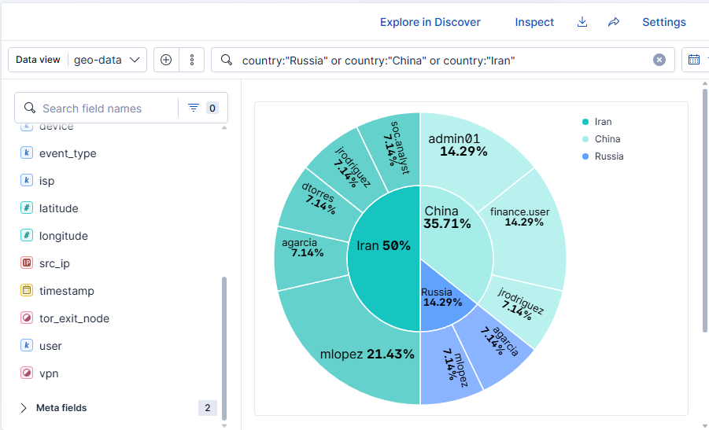
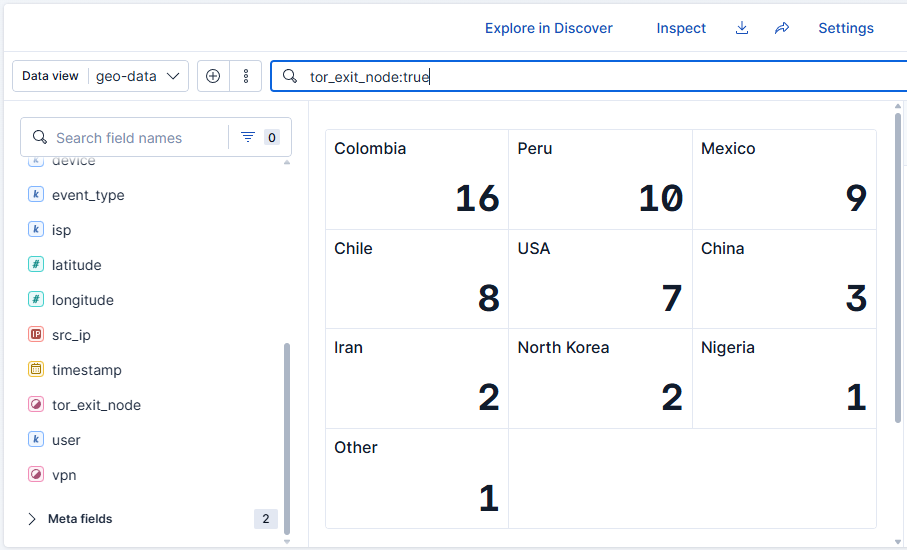
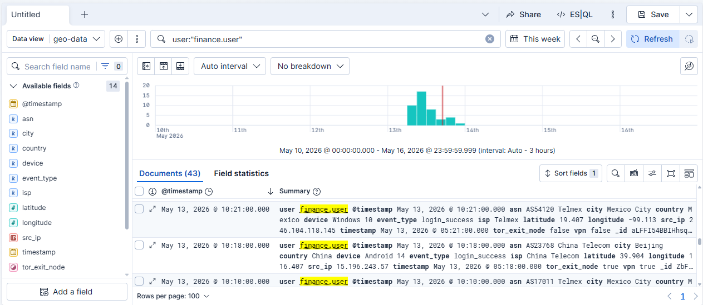
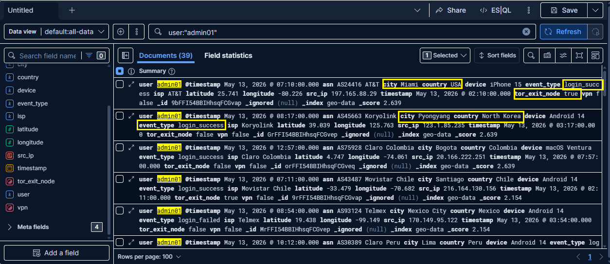
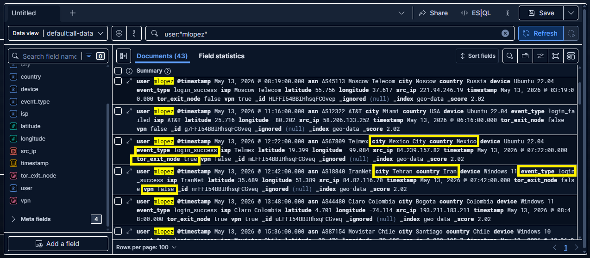

# Geo Anomaly Authentication Detection

This lab simulates a SOC environment focused on detecting geographic anomalies in authentication events using Elastic Stack and KQL queries.

The main objective is to identify suspicious and impossible login events (“Impossible Travel”) using geolocation data, temporal analysis, and basic threat hunting techniques.

---

# Objective

Detect suspicious authentication events through geolocation analysis, IP address investigation, and KQL queries in Elastic Stack.

---

# Lab Scenario

A simulated corporate authentication dataset was generated using Python, including:

- Successful and failed login events
- VPN usage
- TOR node activity
- Logins from multiple countries
- Impossible travel events
- Suspicious activity based on rapid location changes

---

# Tools Used

- Elastic Stack
- Kibana
- Python
- KQL (Kibana Query Language)

---

# Methodology

1. A simulated authentication dataset was generated using Python in `.ndjson` format.

2. The dataset was uploaded into Kibana for event analysis and visualization.

3. KQL queries were used to identify:
   - VPN activity,
   - TOR connections,
   - suspicious countries,
   - compromised users,
   - failed authentication events.

4. Suspicious events were analyzed using:
   - timestamps,
   - geolocation,
   - latitude and longitude,
   - distance between locations,
   - elapsed time between authentications.

5. Multiple “Impossible Travel” events were identified where the same user authenticated from geographically incompatible countries within impossible timeframes.

---

# KQL Queries Used

## VPN Activity

```kql
vpn:true
```

## TOR Activity

```kql
tor_exit_node:true
```

## Suspicious Countries

```kql
country:"Russia" or country:"China" or country:"Iran"
```

## Specific User Investigation

```kql
user:"finance.user"
```

---

# Findings

Multiple suspicious events were identified related to:

- VPN usage,
- TOR connections,
- failed authentication attempts,
- rapid geolocation changes,
- impossible travel events.

One of the detected events showed the same user authenticating from China and Mexico within approximately 3 minutes, requiring a physically impossible travel speed.

---

# Evidence

Lab screenshots can be found in the following directory:

```text
/screenshots
```

---

## Overall Authentication Distribution by Country

This visualization helped identify the countries with the highest volume of authentication events within the dataset.


Key findings:

- Colombia showed the highest number of authentication events.
- Additional activity was identified from:
  - China,
  - Iran,
  - North Korea,
  - Nigeria.

The presence of multiple high-risk countries enabled further geolocation and potential account compromise investigations.

---

## Suspicious Country Activity

Events originating from suspicious countries were filtered using KQL queries.



Query used:

```kql
country:"Russia" or country:"China" or country:"Iran"
```

Key findings:

- Multiple users showed activity from:
  - China,
  - Russia,
  - Iran.

- Some events included:
  - VPN usage,
  - TOR activity,
  - rapid location changes,
  - successful authentications from unusual locations.

---

## TOR Activity

Connections originating from TOR exit nodes were identified using:

```kql
tor_exit_node:true
```



Key findings:

- TOR events were detected from:
  - Colombia,
  - Peru,
  - Mexico,
  - USA,
  - China,
  - Iran.

TOR activity was considered suspicious because this type of infrastructure is commonly used for anonymization and evasion.

---

## VPN Activity

VPN-authenticated events were analyzed using:

```kql
vpn:true
```


Key findings:

- VPN activity was detected from multiple countries.
- Some events correlated with:
  - successful authentications,
  - TOR connections,
  - rapid geolocation changes.

---

# Main Findings

## Impossible Travel #1

During the investigation, an impossible travel event related to the user:

```text
finance.user
```

was identified.

The user authenticated from:

| Timestamp | Country | City |
|---|---|---|
| 2026-05-13 05:18 | China | Beijing |
| 2026-05-13 05:21 | Mexico | Mexico City |



The approximate distance between both locations exceeds 12,000 km, while the time difference was approximately 3 minutes.

The required travel speed would be physically impossible.

This may indicate:
- credential compromise,
- VPN/TOR usage,
- unauthorized access,
- geolocation evasion.

---

## Impossible Travel #2

Another impossible travel event was identified involving the user:

```text
admin01
```

| Timestamp | Country | City |
|---|---|---|
| 2026-05-13 07:10 | USA | Miami |
| 2026-05-13 08:17 | North Korea | Pyongyang |



Suspicious authentication activity was detected involving the account `admin01`, which successfully authenticated from Miami, USA and later from Pyongyang, North Korea within approximately one hour.

The geographic distance between both locations exceeds 12,000 km, requiring a physically impossible travel speed greater than 11,000 km/h.

This event was classified as a potential impossible travel case and possible credential compromise.

---

## Impossible Travel #3

Suspicious activity related to the user:

```text
mlopez
```

was identified.

| Timestamp | Country | City |
|---|---|---|
| 2026-05-13 12:22 | Mexico | Mexico City |
| 2026-05-13 12:42 | Iran | Tehran |



Successful login events were detected from Mexico and Iran within approximately 20 minutes between both events.

The approximate distance between Mexico City and Tehran is around 12,500 km, requiring a travel speed of approximately 37,272 km/h.

No conventional transportation method could realistically complete such travel within 20 minutes.

Additionally, previous TOR-related activity was identified for the user, while VPN usage remained disabled during both authentication events.

---

# Conclusion

This lab successfully simulated basic SOC detection techniques used to identify suspicious authentication activity, VPN/TOR evasion, and geographic anomalies related to login events.

The project demonstrated the use of Elastic Stack and KQL queries to investigate simulated authentication events and detect behaviors similar to those observed in real-world cybersecurity environments.

---
